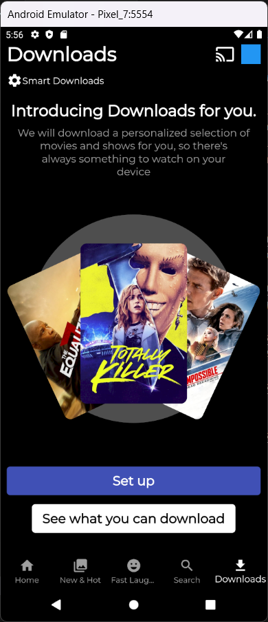

# Netflix Clone Application Using Bloc 

## Description

This is a Netflix Clone application built using Flutter and Bloc state management. It allows users to browse and watch various movies and TV shows. The app provides a similar experience to the original Netflix application, with an easy-to-use interface and a wide range of content to choose from.

## Features

- User authentication: Sign up and login to access personalized recommendations and watch history.
- Home screen: Browse through the latest and popular movies and TV shows.
- Categories: Explore different categories such as Action, Drama, Comedy, etc.
- Search functionality: Search for specific movies or TV shows.
- Watchlist: Add movies or TV shows to your watchlist for easy access later.
- Play video: Stream movies and TV shows directly within the app.
- Customized profiles: Manage multiple profiles within the same account.

## Technologies Used

- Flutter: A UI toolkit for building natively compiled applications for mobile, web, and desktop from a single codebase.
- Bloc: A state management library that helps manage the app's state and handle complex asynchronous operations.

## Installation

1. Install Flutter by following the official Flutter installation guide: [Flutter Installation](https://flutter.dev/docs/get-started/install)
2. Clone the repository: `git clone https://github.com/your-username/netflix-clone.git`
3. Change directory to the project: `cd netflix-clone`
4. Install dependencies: `flutter pub get`
5. Run the app: `flutter run`

## Screenshots

*Home screen showcasing recommended movies and TV shows.*

*New & Hot screen displaying different upcoming content.*

*Fast Laugh screen with video scenes about the selected movie.*

*Search details screen with information about the top searched movie and tv shows in list mode.*

*Search details screen with information about the specific searched movie and tv shows in grid mode.*

*Download screen with information about the downloaded movies and tv shows.*

## Acknowledgements

This application was developed as a project for learning purposes. It is not intended for commercial use and does not provide real-time streaming services. The content used in the app is for demonstration only and not intended for distribution.